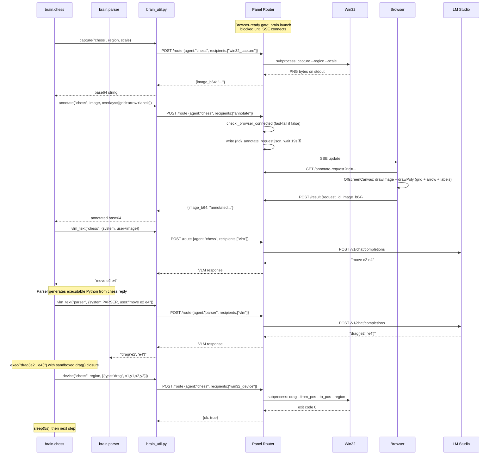
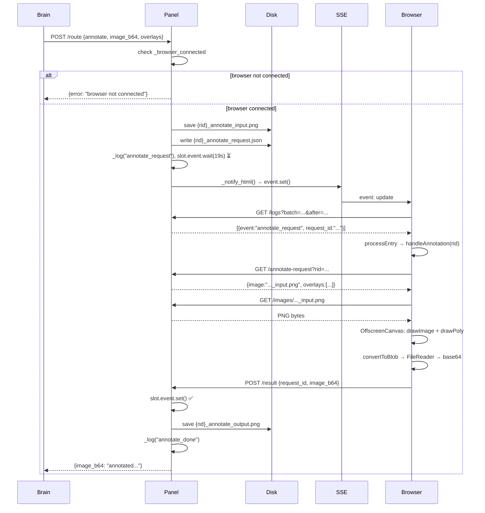

# Franz Plumbing — Autonomous Agent Platform

> A platform where vision-language models physically control a Windows 11 PC
> by looking at screenshots, thinking about what they see, and moving the mouse.
> Intelligence lives in VLM calls. Everything else is dumb plumbing.

---

## What This Is (For Non-Programmers)

Imagine you could sit a very smart robot in front of your computer, let it look at the screen
through a camera, think about what it sees, and then move the mouse and type on the keyboard
to accomplish tasks. That's what this project does — except the "robot" is a vision-language
model (a type of AI that understands images) running on your own PC.

The project is built like plumbing in a house:
- **Pipes** carry messages between components (the panel server)
- **Faucets** do physical actions on screen (the Win32 controller)
- **A window** shows you what's flowing through the pipes in real time (the dashboard)
- **Brains** are the smart parts that decide what to do (VLM calls)

The pipes don't care what flows through them. The faucets don't care who turned them on.
Each piece works independently. You can replace any brain with a completely different one —
chess, web browsing, form filling, game playing — and the plumbing just works.

---

## Architecture

### The Complete System — Every Component, Every Wire, Every Endpoint

This is the full picture. Every file, every HTTP endpoint, every subprocess call, every
data path. Nothing is hidden.

```mermaid
graph TB
    subgraph "Brain Process (any brain_*.py)"
        BRAIN_CHESS["🧠 brain.chess<br/>Chess Analysis Agent"]
        BRAIN_PARSER["🧠 brain.parser<br/>Code Generation Agent"]
        BRAIN_SDK["📦 brain_util.py<br/>route() capture() annotate()<br/>vlm_text() device() overlay()"]
    end

    subgraph "Panel Server (panel.py — HTTP Router + Sole Logger)"
        ROUTER["📡 POST /route<br/>{agent, recipients:[target], ...}"]
        LOGGER["📝 JSONL Logger<br/>_log() → runs/timestamp/log_NNNN.jsonl<br/>Zero truncation, every field"]
        SSE["📡 GET /events<br/>SSE: connected, update, keepalive"]
        LOGS_EP["📋 GET /logs<br/>?batch=&after= → JSONL lines"]
        READY_EP["✅ GET /ready<br/>{region, scale, run_dir}"]
        IMG_EP["🖼️ GET /images/filename.png"]
        ANN_REQ_EP["📎 GET /annotate-request?rid=<br/>Returns {image, overlays}"]
        RESULT_EP["📮 POST /result<br/>{request_id, image_b64}"]
        HTML_EP["🌐 GET / → panel.html"]
        GATE["🚦 Browser-Ready Gate<br/>Brain launch waits for SSE connect"]

        CAP_H["📸 _handle_capture<br/>subprocess → win32.py capture"]
        ANN_H["🎨 _handle_annotate<br/>Fast-fail if no browser,<br/>else write request JSON, wait 19s"]
        VLM_H["🤖 _handle_vlm<br/>Forward to LM Studio"]
        DEV_H["🖱️ _handle_device<br/>subprocess → win32.py actions"]
    end

    subgraph "Browser Dashboard (panel.html)"
        DASH["📊 PCB Diagram<br/>IC components + wires + trace"]
        CANVAS["🖼️ OffscreenCanvas<br/>Annotation Renderer<br/>drawPoly() → PNG base64"]
        REPLAY["⏯️ Replay Controls<br/>Play/Pause/Step/Scrub/Speed"]
        ELK_LAYOUT["📐 ELK.js Layered Layout"]
        GSAP_ANIM["✨ GSAP Wire Animations"]
    end

    subgraph "Win32 Subprocess (win32.py)"
        SCREEN["📸 capture --region --scale"]
        MOUSE["🖱️ click/drag/double_click/right_click"]
        KBD["⌨️ type_text/press_key/hotkey"]
        SCROLL["🔄 scroll_up/scroll_down"]
        CURSOR["📍 cursor_pos --region"]
        SELECT["🔲 select_region"]
    end

    subgraph "LM Studio (localhost:1235)"
        VLM["🤖 POST /v1/chat/completions<br/>OpenAI-compatible API"]
    end

    BRAIN_CHESS --> BRAIN_SDK
    BRAIN_PARSER --> BRAIN_SDK
    BRAIN_SDK -->|"HTTP POST"| ROUTER

    ROUTER --> CAP_H
    ROUTER --> ANN_H
    ROUTER --> VLM_H
    ROUTER --> DEV_H
    ROUTER -->|"every message"| LOGGER

    CAP_H -->|"subprocess.run()"| SCREEN
    DEV_H -->|"subprocess.run()"| MOUSE
    DEV_H -->|"subprocess.run()"| KBD
    DEV_H -->|"subprocess.run()"| SCROLL
    VLM_H -->|"HTTP POST"| VLM

    SCREEN -->|"PNG on stdout"| CAP_H
    VLM -->|"JSON response"| VLM_H

    LOGGER -->|"event.set()"| SSE
    SSE -->|"event stream"| DASH
    DASH -->|"poll"| LOGS_EP
    DASH -->|"fetch"| IMG_EP
    DASH -->|"fetch"| ANN_REQ_EP
    CANVAS -->|"POST"| RESULT_EP
    RESULT_EP -->|"slot.event.set()"| ANN_H

    GATE -->|"blocks brain launch"| BRAIN_SDK

    ELK_LAYOUT --> DASH
    GSAP_ANIM --> DASH
    REPLAY --> DASH

    style BRAIN_CHESS fill:#1a1a2e,stroke:#a3e635,stroke-width:2px,color:#e0e0ea
    style BRAIN_PARSER fill:#1a1a2e,stroke:#a3e635,stroke-width:2px,color:#e0e0ea
    style BRAIN_SDK fill:#1a1a2e,stroke:#a3e635,stroke-width:1px,color:#e0e0ea
    style ROUTER fill:#1a1a2e,stroke:#4a9eff,stroke-width:2px,color:#e0e0ea
    style LOGGER fill:#1a1a2e,stroke:#4a9eff,stroke-width:1px,color:#e0e0ea
    style VLM fill:#1a1a2e,stroke:#f97316,stroke-width:2px,color:#e0e0ea
    style DASH fill:#1a1a2e,stroke:#c084fc,stroke-width:2px,color:#e0e0ea
    style CANVAS fill:#1a1a2e,stroke:#c084fc,stroke-width:1px,color:#e0e0ea
    style SCREEN fill:#1a1a2e,stroke:#3ecf8e,stroke-width:2px,color:#e0e0ea
    style GATE fill:#1a1a2e,stroke:#f97316,stroke-width:2px,color:#e0e0ea
```



### Chess Brain — exec()-Based Code Generation Pipeline

The chess brain uses a two-VLM pipeline where the parser VLM generates executable Python
code that runs directly via `exec()`. No regex parsing, no string extraction — the parser
outputs `drag('e2', 'e4')` and the brain executes it.



### The exec() Architecture

The parser VLM is told it's a Python programmer with one function: `drag('FROM', 'TO')`.
Its output is cleaned (strip `<think>` tags and markdown fences) then executed directly:

```python
exec(clean, {"__builtins__": {}}, {"drag": drag})
```

The `drag()` closure converts chess squares to NORM coordinates and calls `bu.device()`.
The sandbox exposes only `drag` — no builtins, no imports, no file access.

If the parser outputs garbage, `exec()` raises an exception, the `try/except` catches it,
and the round fails silently. The brain process survives and retries next step.

**Benchmark (run 20260317_191253):** 29 rounds, 29/29 valid `drag()` calls from parser,
25/29 device actions succeeded, zero errors. Previous regex-based architecture: 1/9 valid.

### Prompt Design — Natural Language Bridge

The chess VLM outputs `move e2 e4` (not bare `e2e4`). When this lands in the parser's
user message, it reads as a natural language request — "move from e2 to e4" — which the
parser VLM naturally converts to `drag('e2', 'e4')`.

The word `move` is the bridge. Without it, the parser sometimes parrots bare tokens
like `b2b3` instead of wrapping them. With it, 29/29 rounds produced valid code.

### Annotation Overlays

The brain annotates each screenshot with:
1. **8×8 grid** — green lines (stroke_width=4) so the VLM can identify squares
2. **Red arrow** — shows the last move (shaft + triangular arrowhead, stroke_width=3)
3. **Square labels** — FROM and TO squares labeled at arrow endpoints (e.g. "E2", "E4")
4. **Warning text** — "PREVIOUS MOVE — DO NOT REPEAT UNLESS STRICTLY NECESSARY" at top center

All overlays render via `drawPoly()` in the browser's OffscreenCanvas. Single-point
overlays (labels, warning text) render as centered text with a dark background pill.

### Annotation Round-Trip — The Non-Obvious Part

The annotation system is the most complex data flow. The brain needs overlays drawn on
a screenshot, but the rendering happens in the browser (because OffscreenCanvas is the
simplest way to composite images with vector overlays). Here's exactly how it works:




### File Independence — Process Boundaries

Every file runs in its own process. They communicate only through HTTP and subprocess pipes.

```
panel.py          ← HTTP server, sole logger, subprocess launcher
  ├── win32.py    ← subprocess: screen capture, mouse, keyboard (Windows-only)
  ├── panel.html  ← browser: dashboard + annotation renderer
  └── brain_chess_players.py  ← subprocess: chess brain (uses brain_util.py)
        └── brain_util.py     ← SDK: HTTP client to panel.py
```

You can kill the brain and restart it. You can close the browser and reopen it.
The panel server keeps running and logging. The only hard dependency is that the
browser must connect (SSE) before the brain launches (browser-ready gate).

### Coordinate System

Everything uses a 1000×1000 normalized coordinate space (`NORM = 1000`).

- Screen positions, regions, and overlay points are all in NORM coordinates
- `win32.py` converts NORM → screen pixels using the selected region
- Chess squares map to NORM via `_uci_to_norm()`: column a–h → x, row 1–8 → y (bottom-up)
- The grid divides the 1000×1000 space into 8×8 cells of 125×125 each

### Brain Template Structure

Any brain follows this pattern:

```python
import brain_util as bu

# 1. Parse args (--region, --scale)
args = bu.parse_brain_args(sys.argv[1:])

# 2. Loop forever
while True:
    image = bu.capture(agent, region, scale=scale)     # screenshot
    annotated = bu.annotate(agent, image, overlays)     # add visual aids
    reply = bu.vlm_text(agent, bu.make_vlm_request(...))  # ask VLM
    # ... parse reply, execute actions ...
    bu.device(agent, region, actions)                   # move mouse
    time.sleep(delay)
```

The SDK (`brain_util.py`) handles all HTTP communication with the panel server.
The brain only needs to decide what to capture, what to ask, and what to do.

### Dashboard — PCB-Style Electronic Diagram

The dashboard (`panel.html`) renders the system as an electronic circuit board:

- **IC chips** — each component (panel, VLM, win32, browser, brain agents) is a chip
- **Wires** — connections between chips, animated with GSAP when data flows
- **Signal trace** — bottom panel shows every event in chronological order
- **Agent detail** — brain chips show raw/annotated images, system/user/reply prompts
- **ELK.js layout** — automatic layered graph positioning
- **Replay controls** — play/pause/step/scrub through recorded runs

The dashboard also serves as the annotation renderer: when the brain requests an
annotated image, the browser's OffscreenCanvas draws the overlays and POSTs the
result back to the panel server.

---

## Browser-Ready Gate

The brain process cannot start until the browser connects via SSE. This prevents
the brain from requesting annotations before the browser is ready to render them.

```
panel.py starts → opens browser → waits for SSE connect (30s timeout)
                                  ↓
browser loads panel.html → EventSource("/events") → SSE "connected"
                                  ↓
panel.py receives SSE connect → _browser_ready.set() → launches brain subprocess
```

The brain launch happens in a daemon thread so the HTTP server keeps serving
while waiting for the browser.

---

## Running

### Prerequisites

- Windows 11 (for win32.py screen capture and input simulation)
- Python 3.12+
- LM Studio running on `localhost:1235` with a vision-language model loaded
  (tested with Qwen 2.5 VL 3B)

### Live Mode

```bash
python panel.py brain_chess_players.py
```

1. A crosshair overlay appears — drag to select the chess board region
2. A second crosshair appears — drag a horizontal reference for scale calibration
3. The browser opens with the PCB dashboard
4. The brain starts playing chess automatically

### Replay Mode

```bash
python panel.py --replay runs/20260317_191253
```

Opens the dashboard with recorded data. Use the replay controls (play/pause/step/scrub)
to step through the run. All images, prompts, and VLM replies are preserved.

---

## File Map

| File | Lines | Role |
|------|------:|------|
| `panel.py` | 777 | HTTP router, JSONL logger, subprocess launcher, SSE server |
| `panel.html` | 925 | PCB dashboard, annotation renderer (OffscreenCanvas), replay UI |
| `win32.py` | 854 | Screen capture, mouse/keyboard input, region selector (ctypes) |
| `brain_chess_players.py` | 208 | Chess brain: two-VLM pipeline with exec()-based code generation |
| `brain_util.py` | 180 | Brain SDK: HTTP client for capture, annotate, VLM, device, overlay |
| **Total** | **2944** | |

---

## Benchmark Results

### Run 20260317_191253 — 29 Rounds, Zero Errors

| Metric | Value |
|--------|-------|
| Total events logged | 431 |
| Rounds completed | 29 |
| Parser produced valid `drag()` | 29/29 (100%) |
| Device actions succeeded | 25/29 (86%) |
| Error events | 0 |
| VLM model | Qwen 2.5 VL 3B |

The 4 device failures are chess-quality issues (VLM chose algebraic notation like `Nc3`
without coordinates, parser guessed `drag('FROM', 'TO')` literally). The plumbing
executed every `drag()` call it received correctly.

### Previous Architecture Comparison

| Architecture | Parser success rate | Failure mode |
|-------------|-------------------|--------------|
| Regex extraction | 1/9 (11%) | Regex couldn't match VLM output variations |
| exec() code generation | 29/29 (100%) | N/A |

---

## Known Issues

### Chess VLM Quality

The chess VLM (Qwen 2.5 VL 3B) sometimes outputs algebraic notation (`Nc3`, `Nf3`)
instead of the requested `move FROM TO` format. The parser can't convert these because
they don't contain source squares. A stronger VLM or few-shot examples in the prompt
would fix this.

### Annotation Timeout

If the browser tab is backgrounded or throttled, annotation rendering can exceed the
19-second timeout. The round fails and retries on the next step.

### Single Brain Process

Only one brain process runs at a time. The panel server supports multiple agents
conceptually (routing by agent name) but the launch mechanism starts one subprocess.

```
## Claude Opus 4.6 Continuation Prompt

You are helping build Franz Plumbing — an autonomous agent platform where VLMs
physically control a Windows 11 PC by looking at screenshots and moving the mouse.
Intelligence lives in VLM calls. Everything else is dumb plumbing.

## Architecture (5 files, 2944 lines total)

panel.py (777 lines) — HTTP server on :1236, sole JSONL logger, subprocess launcher.
Routes POST /route to handlers: win32_capture, annotate, vlm, win32_device.
SSE endpoint /events notifies browser. Browser-ready gate blocks brain launch
until SSE connects. Replay mode: --replay <run_dir>.

panel.html (925 lines) — PCB-style dashboard + annotation renderer. ELK.js layout,
GSAP wire animations, replay controls. OffscreenCanvas renders overlays via drawPoly()
and POSTs annotated PNG back to panel. Single-point overlays render as centered text
with dark background pill (labels, warning text).

win32.py (854 lines) — Windows-only subprocess. Screen capture (BGRA→PNG), mouse
(click/drag/double_click/right_click/scroll), keyboard (type_text/press_key/hotkey),
cursor_pos, select_region. All positions in NORM 1000×1000 coordinate space.

brain_chess_players.py (208 lines) — Chess brain. Two-VLM pipeline:
  1. Chess VLM sees annotated screenshot, outputs "move e2 e4"
  2. Parser VLM converts to drag('e2', 'e4')
  3. exec() runs parser output in sandbox: {"__builtins__": {}, "drag": drag}
  4. drag() closure converts squares to NORM coords, calls bu.device()
  try/except around exec() — bad parser output fails the round, not the process.

brain_util.py (180 lines) — Brain SDK. route(), capture(), annotate(), vlm_text(),
device(), overlay(), make_vlm_request(). HTTP client to panel on :1236.
NORM=1000, VLM on localhost:1235 (OpenAI-compatible).

## Key Design Decisions

- exec() code generation, NOT regex parsing. Parser VLM outputs executable Python.
  29/29 success rate vs 1/9 with old regex approach.
- Chess agent says "move FROM TO" so parser receives a natural language request,
  not a bare token. The word "move" is the bridge that prevents parroting.
- Annotation overlays: 8×8 green grid (stroke_width=4), red arrow for last move
  (stroke_width=3), square labels at endpoints, warning text at top center.
- drawPoly() handles single-point overlays (pts.length >= 1) for labels/text.
  Multi-point overlays (pts.length >= 2) draw lines/polygons.
- No safety checks, no fallbacks. exec() the parser output directly.
- Annotations render in browser OffscreenCanvas, round-trip through panel via
  annotate_request.json → SSE notify → browser renders → POST /result.
- Browser-ready gate: brain launch blocked until SSE connects (30s timeout).
- All coordinates NORM 1000×1000. win32.py converts to screen pixels.

## Prompts (in brain_chess_players.py)

AGENT_SYSTEM: Chess engine playing White. Red arrow marks last move. Reply "move FROM TO".
AGENT_USER: Dynamic — includes last_move context, urgency language.
PARSER_SYSTEM: Python programmer with one function drag('FROM','TO'). Convert user's
  move request into a single drag() call.
PARSER_USER: Just {raw_text} — passthrough of chess agent reply.

## TaskConfig defaults
grid_size=8, grid_color=rgba(0,255,200,0.95), grid_stroke_width=4,
arrow_color=rgba(255,60,60,0.9), arrow_stroke_width=3,
agent_max_tokens=200, parser_max_tokens=30, post_action_delay=5.0

## Rules
- Only modify brain_chess_players.py unless explicitly told otherwise
- No tests unless explicitly requested
- No safety checks or fallbacks — dumb plumbing philosophy
- System prompts are static identity/rules only; dynamic context goes in user message
- Minimal code only — no verbose implementations
```
